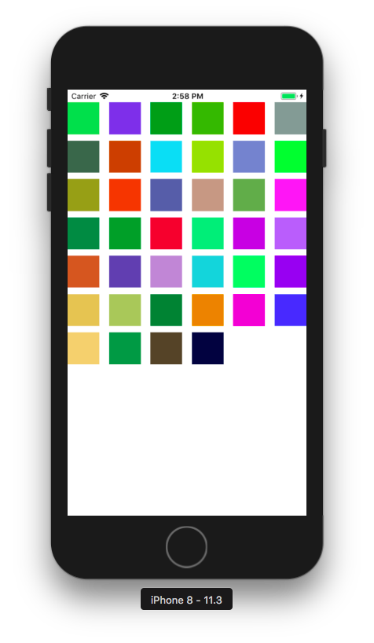

# Photo App

## CollectionView 생성
</img>

### CollectionView를 화면에 꽉 채우고, 40개 cell을 랜덤 색상으로 채움
- 시뮬레이터: iPhone 8

### 랜덤 색상 적용 시
- `drand48()` : 0~1 사이 범위 내에서 랜덤 숫자 생성
- UIColor.init()의 RGB 값은 0~1 사이 값을 가지므로, 보통 색상 지정 시 실제 RGB 값을 255로 나눔.
- 랜덤 색상 적용 시에는 0~1 사이의 랜덤 수를 생성하면 되므로, drand48()을 사용함

```swift
static var random: UIColor {
	return UIColor.init(red: CGFloat(drand48()), green: CGFloat(drand48()), blue: CGFloat(drand48()), alpha: 1)
}
```

### 학습 내용
>- **[Collection View 프로그래밍 방식]()**
>- **[Collection View와 TableView와 공통점 및 차이점]()**

2018-04-13 (작업시간: 1일)

<br/>

## Photo 라이브러리 생성
</img>

### CollectionView 셀 크기 조정
#### 컬렉션뷰 셀 크기 변경 (100x100)
- [StoryBoard] 컬렉션 뷰의 셀 크기를 설정할 때는, 레이아웃의 ItemSize에 따라서 달라진다는 사실을 주의한다.
- [Code] UICollectionViewDelegateFlowLayout를 채택한 후, 해당 메소드를 구현 (기본적으로 UICollectionViewDelegate, UICollectionViewDataSource 채택해야)

```swift
func collectionView(_ collectionView: UICollectionView, layout collectionViewLayout: UICollectionViewLayout, sizeForItemAt indexPath: IndexPath) -> CGSize {
    return CGSize(width: ViewConfig.itemWidth, height: ViewConfig.itemHeight)
}
```

#### Cell에 ImageView 추가 (100x100)
- PhotoCell 커스텀 클래스 생성
- UIImageView를 추가하여 제약사항 설정
	- Frame: PhotoCell에 꽉 차도록 설정
	- ContentMode: 꽉 채워 보여주기 위해 scaleToFill로 설정

```swift
class PhotoCell: UICollectionViewCell, Reusable {
    @IBOutlet weak var photoImageView: UIImageView! {
        didSet {
            photoImageView.translatesAutoresizingMaskIntoConstraints = false
            photoImageView.leadingAnchor.constraint(equalTo: self.leadingAnchor).isActive = true
            photoImageView.trailingAnchor.constraint(equalTo: self.trailingAnchor).isActive = true
            photoImageView.topAnchor.constraint(equalTo: self.topAnchor).isActive = true
            photoImageView.bottomAnchor.constraint(equalTo: self.bottomAnchor).isActive = true
            photoImageView.contentMode = .scaleAspectFill
        }
    }
}
```

### 사진보관함에 있는 사진 이미지를 Cell에 표시
#### Photos 라이브러리 사용하여 사진보관함의 사진 불러오기
- 불러온 사진 데이터를 관리하는 Photos 클래스 작성 및 내부 사진들을 클래스 이름으로 접근하기 위해 Sequence를 채택
- PHAsset의 fetchAssets()를 통해 사진보관함의 사진들을 PHFetchResult<PHAsset> 형태로 불러옴
- option: 생성일(creationDate) 기준 내림차순(descending). 즉, 최신순으로 정렬

```swift
class Photos {
    private(set) var photoAssets = PHFetchResult<PHAsset>()
    ...
    private func fetchAllPhotosFromLibrary() -> PHFetchResult<PHAsset> {
        let options = PHFetchOptions()
        options.sortDescriptors = [NSSortDescriptor.init(key: "creationDate", ascending: false)]
        return PHAsset.fetchAssets(with: options)
    }
    ...
}
```

#### PHCachingImageManager 클래스 사용하여 Cell에 이미지 표시
- CollectionView의 특정 셀에 이미지를 표시하기 위해, 다운받은 photos 중 cell 위치와 동일한 PHAsset 데이터를 UIImage로 파싱하여 넘기는 함수 구현
- PHCachingImageManager의 requestImage() 사용
- 타깃 사이즈는 imageView 사이즈와 동일
- contentMode는 PHImageContentMode 타입으로, 이미지를 자르는 모드이다. aspectFill로 설정하여 이미지뷰를 꽉 채울 수 있는 크기로 자를 수 있도록 함
- 탈출 클로저를 파라미터에 정의하여 image를 메소드 호출 부분에서 처리하도록 함

```swift
private let imageManager: PHCachingImageManager
...
func requestImage(at index: Int, _ completion: @escaping (UIImage?) -> (Void)) {
        imageManager.requestImage(for: photos.at(index),
                                  targetSize: CGSize(width: ViewConfig.itemWidth, height: ViewConfig.itemHeight),
                                  contentMode: PHImageContentMode.aspectFill,
                                  options: nil) { image, _ in completion(image) }
}
```

- 메소드 호출 부분 (ViewController)

```swift
func collectionView(_ collectionView: UICollectionView, cellForItemAt indexPath: IndexPath) -> UICollectionViewCell {
    let cell = collectionView.dequeueReusableCell(withReuseIdentifier: PhotoCell.id, for: indexPath) as! PhotoCell
    photoService.requestImage(at: indexPath.item) { image in
        cell.photoImageView.image = image
    }
	return cell
}
```

#### PHPhotoLibrary 클래스 사용하여 사진보관함 변경 여부를 관찰
- Photos 데이터를 다루는 PhotoService 클래스를 정의: Photos는 자료구조로만 사용하기 위함
- PHPhotoLibraryChangeObserver를 채택하여 `PHPhotoLibrary.shared().register(self)`로 옵저버를 등록하면 사진보관함의 변경 여부를 알 수 있음
- PHPhotoLibraryChangeObserver의 photoLibraryDidChange() 메소드를 구현하여 사진보관함 변경 시 처리할 로직 추가: 변경사항으로 Photos를 업데이트하고, VC에 노티를 보내어 뷰를 변경할 수 있도록 함

```swift
func photoLibraryDidChange(_ changeInstance: PHChange) {
    guard let changes = changeInstance.changeDetails(for: self.photos.photoAssets) else { return }
    self.photos.updateAssets(with: changes.fetchResultAfterChanges)
    NotificationCenter.default.post(name: .photoLibraryChanged, object: nil,
                                    userInfo: [NotificationKeys.photoChanges: changes])
}
```

- VC에서 변경사항을 받아 뷰 업데이트: changes가 큰 변화인 경우, 전체 컬렉션뷰 데이터를 재로드. 점진적인 변경사항이라면, 해당 부분만 업데이트.

```swift
@objc func updateCollectionView(notification: Notification) {
    guard let userInfo = notification.userInfo,
        let changes = userInfo[NotificationKeys.photoChanges] as? PHFetchResultChangeDetails<PHAsset> else { return }
    DispatchQueue.main.async {
        changes.hasIncrementalChanges ? self.updateChangedItems(changes) : self.collectionView.reloadData()
    }
}
```

- 점진적인 변경사항인 경우: 변경된 인덱스들만 배치 업데이트. 앱이 running 중에 사진첩에 변화가 생기면 바로 반영된다.
- 이 때, **IndexPath.init(index:)를 사용하면 런타임 에러가 발생한다. 따라서 꼭 section을 지정할 수 있는 IndexPath.init(row:section:) 메소드를 사용한다.**

```swift
private func updateChangedItems(_ changes: PHFetchResultChangeDetails<PHAsset>) {
    self.collectionView.performBatchUpdates({
        if let insertedIndexes = changes.insertedIndexes, insertedIndexes.count > 0 {
            self.collectionView.insertItems(at: insertedIndexes.compactMap { IndexPath(row: $0, section: 0) })
        }
        if let deletedIndexes = changes.removedIndexes, deletedIndexes.count > 0 {
            self.collectionView.deleteItems(at: deletedIndexes.compactMap { IndexPath(row: $0, section: 0) })
        }
        if let changedIndexes = changes.changedIndexes, changedIndexes.count > 0 {
            self.collectionView.reloadItems(at: changedIndexes.compactMap { IndexPath(row: $0, section: 0) })
        }
        if changes.hasMoves {
            changes.enumerateMoves {
                self.collectionView.moveItem(at: IndexPath(row: $0, section: 0), to: IndexPath(row: $1, section: 0))
            }
        }
    })
}
```

### 학습 내용
>- **[Photos 라이브러리의 구성]()**
>- **[PHImageContentMode와 UIImageView의 ContentMode의 차이]()**

2018-04-17 (작업시간: 1일)

<br/>