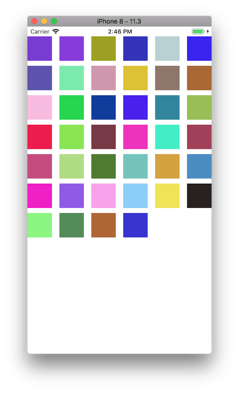
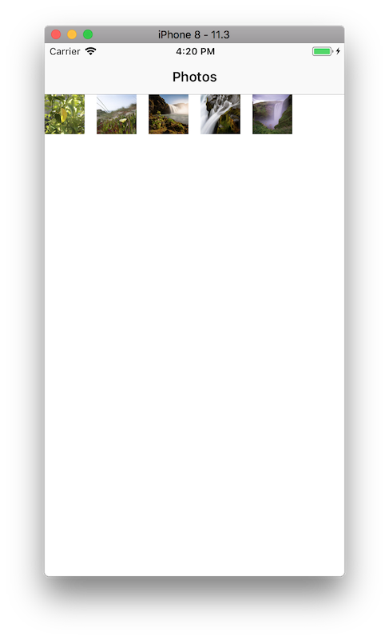

# Photos App

## Step1 (시작하기 - CollectionView)
### 요구사항
- Photos 앱 프로젝트 저장소를 본인 저장소로 fork하고 로컬에 clone한다.
- iOS 프로젝트 Single View App 템플릿으로 하고 프로젝트 이름을 "PhotosApp"으로 지정하고, 위에 만든 로컬 저장소 경로에 생성한다.
- 기본 상태로 아이폰 8 시뮬레이터를 골라서 실행한다.
- readme.md 파일을 자신의 프로젝트에 대한 설명으로 변경한다.
    - 단계별로 미션을 해결하고 리뷰를 받고나면 readme.md 파일에 주요 작업 내용(바뀐 화면 이미지, 핵심 기능 설명)과 완성 날짜시간을 기록한다.
    - 실행한 화면을 캡처해서 readme.md 파일에 포함한다.

### 프로그래밍 요구사항
- 스토리보드 ViewController에 CollectionView를 추가하고 Safe 영역에 가득 채우도록 frame을 설정한다.
- CollectionView Cell 크기를 80 x 80 로 지정한다.
- UICollectionViewDataSource 프로토콜을 채택하고 40개 cell을 랜덤한 색상으로 채우도록 구현한다.

### 결과
#### UI

---
## Step2 (Photos 라이브러리)
### 요구사항
- 사진보관함(카메라롤) 사진들을 CollectionView로 표시하는 것을 목표로 한다.
- readme.md 파일을 자신의 프로젝트에 대한 설명으로 변경한다.
    - 단계별로 미션을 해결하고 리뷰를 받고나면 readme.md 파일에 주요 작업 내용(바뀐 화면 이미지, 핵심 기능 설명)과 완성 날짜시간을 기록한다.
    - 실행한 화면을 캡처해서 readme.md 파일에 포함한다.

### 프로그래밍 요구사항
- UINavigationController를 Embed시키고, 타이틀을 'Photos'로 지정한다.
- PHAsset 프레임워크를 사용해서 사진보관함에 있는 사진 이미지를 Cell에 표시한다.
    - CollectionView Cell 크기를 100 x 100 로 변경한다.
    - Cell을 처리하기 위한 커스텀 클래스를 만들어서 지정한다.
    - Cell을 가득 채우도록 UIImageView를 추가한다.
- PHCachingImageManager 클래스를 활용해서 썸네일 이미지를 100 x 100 크기로 생성해서 Cell에 표시한다.
- PHPhotoLibrary 클래스에 사진보관함이 변경되는지 여부를 옵저버로 등록한다.

### 결과
#### UI

---
## 중간에 고생했던 부분 / 기억할 부분 간단 정리
- CollectionView
    - 테이블 뷰와 유사하지만 좀 더 유연하고 많은 아이템을 배치하여 사용하기에 유용하다.
- PHImageManager
    - thumbnails, full-size image, video 데이터 관련 메소드 제공
- PHCachingImageManager
    - 기본적으로 PHImageManager와 비슷한 기능을 함
    - 많은 양의 데이터를 한번에 불러올때 유용
    - CollectionView 등에서 많은 수의 사진들을 불러올때 사용
    - 많은 데이터를 캐쉬로 불러놓고 현재 스크롤 위치에 따라 알맞은 데이터를 제공해줌
