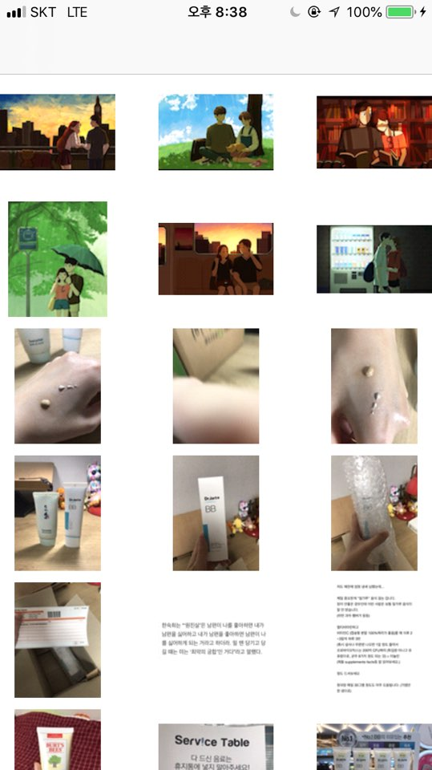
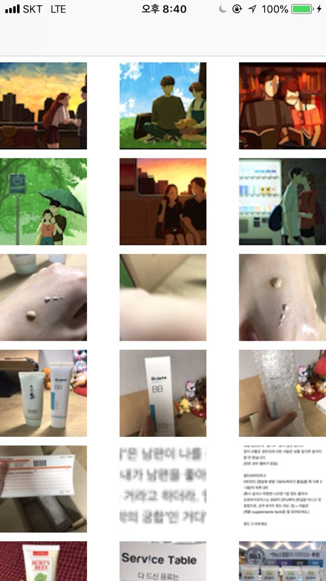
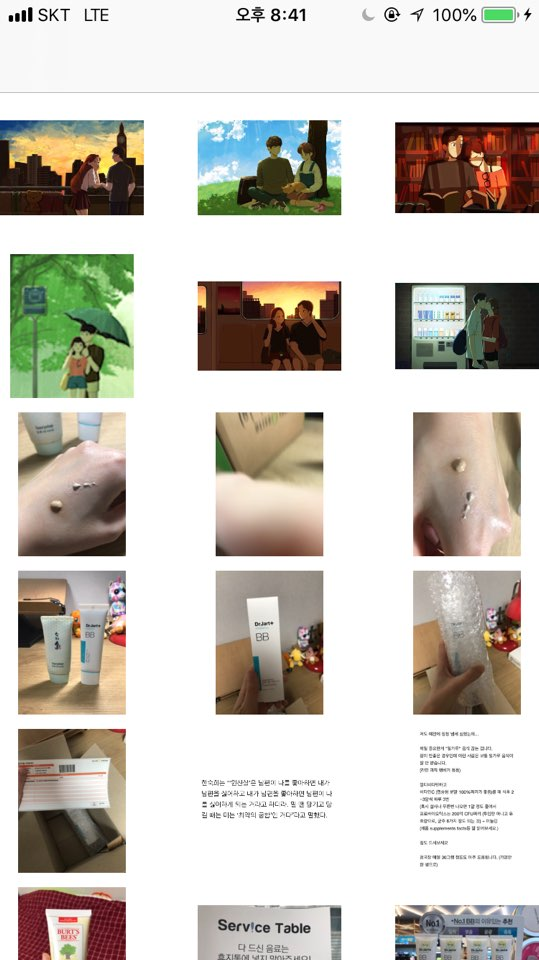

## PHImageContentMode와 ContentMode의 차이
- **requestImage 단계(PHImageContentMode)**: 사진 크기를 썸네일에 맞춰 줄이거나 늘릴 때 어느 비율에 맞출 건지를 결정. 
	- .aspectFit: 원본의 긴 변에 맞춰 전체가 targetSize에 보여줌.
	- .aspectFill: 원본의 짧은 변에 맞춰 꽉 채우도록 함.

- **UIImageView의 contentMode**: 사진을 보여줄 때 어느 비율에 맞출 것인지 결정. 
	- .scaleAspectFit: 이미지의 긴 변에 맞춰 모두 보여줌.
	- .scaleAspectFill: 이미지의 짧은 변에 맞춰 꽉 채우도록 함.
	- 이 때는 화면에 ImageView 크기랑 앞에서 바꾼 이미지 크기랑 다를 때만 영향이 있다. 즉, 이미지 실제 크기와 보여지는 크기가 다를 때는 꼭 필요하다.

- 차이점: PHImageContentMode는 불러온 이미지 크기 자체를 조정하기 위한 모드라면, UIImageView의 ContentMode는 보여주기 위한 모드이므로, 이미지 크기 자체를 손대진 않는다.

#### 1. .aspectFit + .scaleAspectFit
- 사진의 긴 변에 맞춰 크기가 조정되고, 그대로 보여줌.

##### 2. .aspectFill + .scaleAspectFill
- 사진의 짧은 변에 맞춰 크기가 조정되고, 그대로 보여줌.

#### 3. .aspectFit + .scaleAspectFill
- 사진의 긴 변에 맞춰 크기가 조정되는데, 보여줄 때는 꽉 채워보여주기 때문에 이미지가 늘어나 해상도나 낮아진 걸 볼 수 있다.

#### 4. .aspectFill + .scaleAspectFit
- 사진의 짧은 변에 맞춰 크기가 조정되고, 보여줄 때는 전체 사진을 보여주기 때문에 눈으로는 잘 확인은 안 되지만 아마 해상도가 높을 것이다.

